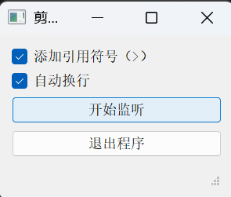

# 剪贴板助手 Clipboard Assistant



## 功能特性
- 📋 实时监听Windows剪贴板内容
- 📁 自动创建/更新当前目录下的`clips.md`文件
- ✒️ 可选添加Markdown引用符号（> ）
- ⏎ 可选自动换行功能
- 🖥 系统托盘常驻后台运行
- ⚙️ 可配置轮询间隔（默认1秒）
- 📈 状态栏实时显示最后复制时间

## 使用场景
1. **阅读/整理资料**：在浏览器/PDF阅读器中复制重点内容时自动保存
2. **写作辅助**：收集灵感片段时自动生成带格式的素材库
3. **代码收集**：复制代码片段时自动创建带格式的代码库
4. **会议记录**：快速保存会议中复制的关键信息

## 安装使用

# 安装依赖
```bash
pip install pyqt5 pyperclip
```

运行程序

```python
python clipAssistant.py
```

输出文件路径

```
OUTPUT_FILE = "clips.md"
```

轮询间隔（毫秒）

```
POLL_INTERVAL = 1000
```


## 注意事项
1. 首次启动会自动创建`clips.md`
2. 使用Typora时建议开启「自动重载文件」功能
3. 程序通过内容比对防重复保存
4. 确保有当前目录的写入权限

> 代码由DeepSeek-R1生成 | 建议使用Python 3.8+环境运行

完整代码已包含以下关键功能：

1. 剪贴板防抖机制
2. 系统托盘最小化功能
自动保存文件编码（UTF-8）
跨平台剪贴板支持（Windows/macOS/Linux）
线程安全的剪贴板监听
实际效果：每次复制内容后，Typora会自动刷新显示新增内容（需开启自动重载），形成按时间排序的引用内容集合。